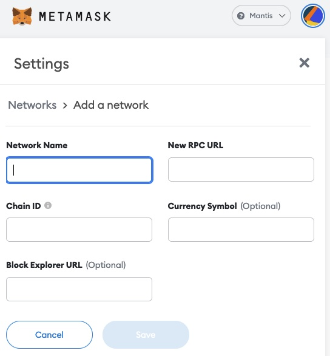

# Mantis [ Dragonfly Testnet ]

#### Blockchain configuration

* ChainID: 96970
* Network Name: Mantis Testnet
* Symbol: MANTIS

#### GRPC Endpoints
* [https://mantis-rpc.phoenix-systems.io](https://mantis-rpc.phoenix-systems.io)
* [https://mantis-rpc.hi1.ch](https://mantis-rpc.hi1.ch)
* [https://mantis-rpc.switch.ch](https://mantis-rpc.switch.ch)
* [https://mantis-rpc.phoenix-technologies.ch](https://mantis-rpc.phoenix-technologies.ch)

#### Block Explorer
* Blockscout: [https://blockscout.mantis.hexapod.network/](https://blockscout.mantis.hexapod.network/)

#### MetaMask Configuration

| Field Name | Value |
| --- | --- |
| Network Name | Mantis (Testnet) |
| New RPC URL | https://mantis-rpc.switch.ch  (or any other RPC URL for Mantis) |
| Chain ID | 96970 |
| Currency Symbol | MANTIS |
| Explorer URL | https://blockscout.mantis.hexapod.network  (for Blockscout) |

#### Useful Links
* [How to add custom networks to MetaMask](https://community.metamask.io/t/how-to-add-custom-networks-to-metamask-like-binance-and-polygon-matic/3634)

## Validator Nodes

Statement of the Validators: [Download](https://github.com/hexapods/mantis/blob/main/statement.pdf) 

* [https://www.ibm.com/it-infrastructure/linuxone](https://www.ibm.com/it-infrastructure/linuxone)
* Validator address: [0x31d1ba7f8d1bd510f2f99e17c1683a1344a2dafa](https://mantis.phoenix-systems.io/address/0x31d1ba7f8d1bd510f2f99e17c1683a1344a2dafa)

* [https://switch.ch](https://switch.ch)
* Validator address: [0x90f5dd1be0b83bb31db66d24d2a120622dcb6547](https://mantis.switch.ch/address/0x90f5dd1be0b83bb31db66d24d2a120622dcb6547)

* [https://phoenix-systems.ch](https://phoenix-systems.ch)
* Validator address: [0xa02ae59fe3f9df09aae83d662fac84d191b31ea5](https://mantis.phoenix-systems.io/address/0xa02ae59fe3f9df09aae83d662fac84d191b31ea5)

* [https://green.ch](https://green.ch)
* Validator address: [0x8b4750a6e5fb57dce05c0db7db096ad5ce8a9d53](https://mantis.phoenix-systems.io/address/0x8b4750a6e5fb57dce05c0db7db096ad5ce8a9d53)

* [https://hi1.ch](https://hi1.ch)
* Validator address: [0x6a2f0de4861b1fab5e4f7e19674102ddff70b77b](https://mantis.phoenix-systems.io/address/0x6a2f0de4861b1fab5e4f7e19674102ddff70b77b)

* [https://phoenix-systems.ch](https://phoenix-systems.ch)
* Validator address: [0xf3fb87de36bbfa1961cdde13ea5bf471c6999791](https://mantis.phoenix-systems.io/address/0xf3fb87de36bbfa1961cdde13ea5bf471c6999791)
